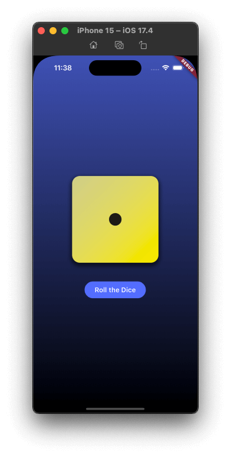

# Roll The Dice

## About the project

Roll The Dice is a cross-platform application built using Flutter.

This is my first project using Flutter. I'm following a Udemy's course, but it has some tweeks on the design and functionalities.

## Features

The main feature of the application is to simulate the roll of a dice. Showing you a different dice on every turn, without repeating the last one.
